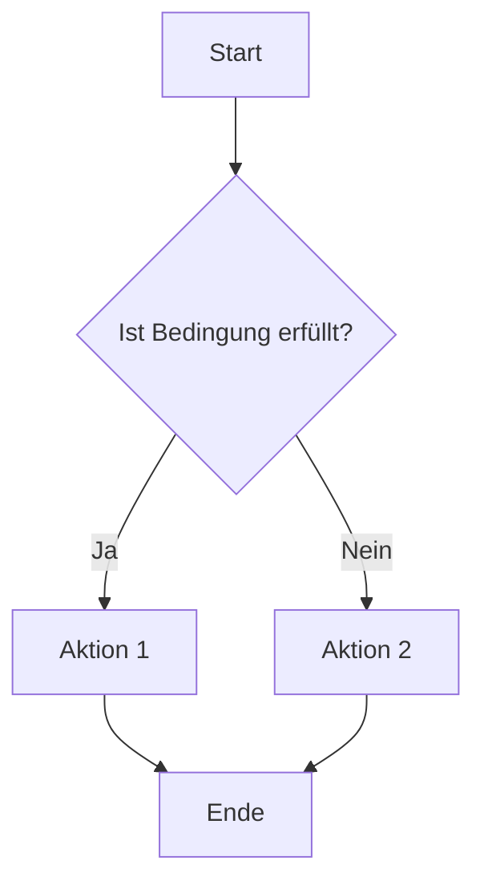

# DOKUMENTATIONSSTANDARDS

Dieses Dokument definiert die verbindlichen Standards für die Dokumentation des Intranet-Projekts. Alle Dokumentationsdateien müssen diesen Standards entsprechen, um eine konsistente und vollständige Dokumentation zu gewährleisten.

## Inhaltsverzeichnis

1. [Allgemeine Richtlinien](#allgemeine-richtlinien)
2. [Dokumentationsstruktur](#dokumentationsstruktur)
3. [Formatierungsrichtlinien](#formatierungsrichtlinien)
4. [Namenskonventionen](#namenskonventionen)
5. [Verlinkungen](#verlinkungen)
6. [Codebeispiele](#codebeispiele)
7. [Bilder und Diagramme](#bilder-und-diagramme)
8. [Versionierung](#versionierung)
9. [Aktualisierungsprozess](#aktualisierungsprozess)

## Allgemeine Richtlinien

- **Vollständigkeit**: Dokumentation muss alle relevanten Aspekte abdecken
- **Klarheit**: Verwende klare, präzise Sprache
- **Aktualität**: Dokumentation muss aktuell und mit dem Code synchronisiert sein
- **Zielgruppenorientierung**: Berücksichtige die Zielgruppe (Entwickler, Administratoren, Endbenutzer)
- **Konsistenz**: Verwende einheitliche Terminologie und Formatierung

## Dokumentationsstruktur

Die Dokumentation ist in folgende Hauptkategorien unterteilt:

### 1. Einstieg und Übersicht
- `README.md` - Projekteinstiegspunkt
- `DOKUMENTATIONSSTANDARDS.md` - Dieses Dokument
- `CHANGELOG.md` - Änderungsverlauf

### 2. Nutzerorientierte Dokumentation
- `BENUTZERHANDBUCH.md` - Anleitung für Endbenutzer
- `ADMINISTRATORHANDBUCH.md` - Anleitung für Administratoren

### 3. Entwicklungsdokumentation
- `ENTWICKLUNGSUMGEBUNG.md` - Setup der Entwicklungsumgebung
- `ARCHITEKTUR.md` - Systemarchitektur
- `CODING_STANDARDS.md` - Programmierrichtlinien
- `DESIGN_STANDARDS.md` - UI/UX-Richtlinien

### 4. Technische Spezifikationen
- `API_REFERENZ.md` - API-Dokumentation
- `DATENBANKSCHEMA.md` - Datenbankschema
- `BERECHTIGUNGSSYSTEM.md` - Berechtigungskonzept
- `DEPLOYMENT.md` - Deployment-Prozess

### 5. Modulspezifische Dokumentation
- `MODUL_ZEITERFASSUNG.md` - Zeiterfassungssystem
- `MODUL_CEREBRO.md` - Cerebro Wiki-System
- `MODUL_TEAMKONTROLLE.md` - Team-Worktime-Control
- `MODUL_ABRECHNUNG.md` - Lohnabrechnungsintegration

## Formatierungsrichtlinien

### Markdown-Syntax

Alle Dokumentationsdateien müssen in Markdown geschrieben sein und folgende Formatierungsrichtlinien einhalten:

#### Überschriften

- Hauptüberschrift (H1): `# Titel`
- Abschnittsüberschrift (H2): `## Abschnitt`
- Unterabschnitt (H3): `### Unterabschnitt`
- Weitere Ebenen (H4-H6): `#### Ebene 4`, `##### Ebene 5`, `###### Ebene 6`

#### Hervorhebungen

- **Fett**: `**fett**`
- *Kursiv*: `*kursiv*`
- ~~Durchgestrichen~~: `~~durchgestrichen~~`
- `Code`: `` `code` ``

#### Listen

- Ungeordnete Listen:
  ```
  - Element 1
  - Element 2
    - Unterelement 2.1
    - Unterelement 2.2
  ```

- Geordnete Listen:
  ```
  1. Erster Schritt
  2. Zweiter Schritt
     1. Unterschritt 2.1
     2. Unterschritt 2.2
  ```

#### Tabellen

```
| Spalte 1 | Spalte 2 | Spalte 3 |
|----------|----------|----------|
| Wert 1   | Wert 2   | Wert 3   |
| Wert 4   | Wert 5   | Wert 6   |
```

#### Codeblöcke

```
```typescript
// TypeScript-Code
const example: string = 'Beispiel';
```
```

#### Zitate

```
> Dies ist ein Zitat.
> Es kann mehrere Zeilen umfassen.
```

### Dokumentstruktur

Jedes Dokumentationsdokument muss folgende Struktur haben:

1. **Titel** (H1): Name des Dokuments
2. **Kurze Beschreibung**: 1-2 Sätze, die den Inhalt des Dokuments zusammenfassen
3. **Inhaltsverzeichnis**: Liste aller Abschnitte mit Links
4. **Hauptinhalt**: Gegliedert in Abschnitte und Unterabschnitte
5. **Abschließende Hinweise** (optional): Wichtige Anmerkungen oder Warnungen

## Namenskonventionen

### Dateinamen

- Alle Dokumentationsdateien haben die Endung `.md`
- Hauptdokumentationsdateien verwenden GROSSBUCHSTABEN mit Unterstrichen: `DOKUMENTATIONSSTANDARDS.md`
- Unterstützende Dokumentationsdateien verwenden kebab-case: `api-endpoints-reference.md`

### Terminologie

- Verwende konsistente Begriffe für Systemkomponenten
- Definiere wichtige Begriffe bei ihrer ersten Verwendung
- Vermeide Jargon und Abkürzungen, es sei denn, sie werden erklärt

## Verlinkungen

### Interne Links

Links zu anderen Dokumentationsdateien müssen relativ sein:

```markdown
Weitere Informationen findest du in der [API-Referenz](API_REFERENZ.md).
```

### Abschnittslinks

Links zu Abschnitten innerhalb eines Dokuments:

```markdown
Siehe [Formatierungsrichtlinien](#formatierungsrichtlinien).
```

### Externe Links

Links zu externen Ressourcen:

```markdown
Weitere Informationen findest du in der [React-Dokumentation](https://reactjs.org/docs).
```

## Codebeispiele

### Vollständige Beispiele

Codebeispiele müssen vollständig und funktionsfähig sein:

```typescript
// RICHTIG
import { useState } from 'react';

const Counter: React.FC = () => {
  const [count, setCount] = useState(0);
  
  return (
    <div>
      <p>Count: {count}</p>
      <button onClick={() => setCount(count + 1)}>Increment</button>
    </div>
  );
};

// FALSCH (unvollständig)
const Counter = () => {
  // ...
  return (
    <button onClick={() => setCount(count + 1)}>Increment</button>
  );
};
```

### Sprachspezifische Syntax-Hervorhebung

Verwende sprachspezifische Syntax-Hervorhebung für Codeblöcke:

```
```typescript
// TypeScript-Code
```

```jsx
// JSX-Code
```

```css
/* CSS-Code */
```

```sql
-- SQL-Code
```
```

### Kommentare in Codebeispielen

Verwende Kommentare, um wichtige Aspekte des Codes hervorzuheben:

```typescript
// WICHTIG: Diese Formel ist kritisch für die korrekte Zeitzonenbehandlung
const correctedDate = new Date(new Date().getTime() - new Date().getTimezoneOffset() * 60000);
```

## Bilder und Diagramme

### Bildformate

- Verwende PNG für Screenshots und Diagramme
- Verwende SVG für vektorbasierte Diagramme
- Optimiere Bilder für das Web (Kompression, angemessene Größe)

### Bildplatzierung

Bilder sollten mit einer Beschreibung eingefügt werden:

```markdown

```

### Diagramme

Für komplexe Diagramme verwende [Mermaid](https://mermaid-js.github.io/mermaid/):

```

```

## Versionierung

### Änderungshistorie

Jede signifikante Änderung an der Dokumentation muss im `CHANGELOG.md` dokumentiert werden:

```markdown
## [1.2.0] - 2023-05-15

### Hinzugefügt
- Neue Dokumentation für das Zeiterfassungsmodul

### Geändert
- Aktualisierte API-Referenz für Worktime-Endpunkte

### Behoben
- Korrigierte Fehler in der Beschreibung der Zeitzonenbehandlung
```

### Versionsnummern

Verwende [Semantic Versioning](https://semver.org/):

- **Major** (1.0.0): Inkompatible Änderungen
- **Minor** (0.1.0): Neue Funktionen, abwärtskompatibel
- **Patch** (0.0.1): Bugfixes, abwärtskompatibel

## Aktualisierungsprozess

### Wann aktualisieren

Die Dokumentation muss in folgenden Fällen aktualisiert werden:

1. Bei Änderungen am Code, die das Verhalten oder die API ändern
2. Bei Hinzufügen neuer Funktionen
3. Bei Entfernen oder Ändern bestehender Funktionen
4. Bei Entdecken von Fehlern oder Unklarheiten in der bestehenden Dokumentation

### Wie aktualisieren

1. Identifiziere die betroffenen Dokumentationsdateien
2. Aktualisiere die Dokumentation entsprechend den Änderungen
3. Überprüfe die Konsistenz mit anderen Dokumentationsdateien
4. Aktualisiere das `CHANGELOG.md`
5. Committe die Änderungen zusammen mit dem Code

### Review-Prozess

Dokumentationsänderungen müssen wie Codeänderungen überprüft werden:

1. Überprüfung auf Vollständigkeit
2. Überprüfung auf Klarheit und Verständlichkeit
3. Überprüfung auf Konsistenz mit anderen Dokumenten
4. Überprüfung auf Einhaltung der Dokumentationsstandards

---

Diese Dokumentationsstandards müssen von allen Mitwirkenden eingehalten werden. Bei Fragen oder Unklarheiten wende dich an das Entwicklungsteam.